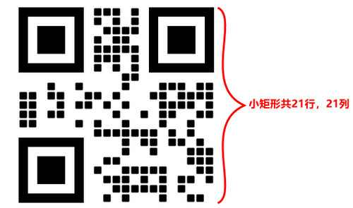

# 什么是二维码版本？

二维码一共有40种规格的矩阵，官方称之为版本即Version，也称为二维码版本。

## 二维码版本介绍

是根据二维码矩阵的行数、列数来区分的，即一行或一列中包含的码点数量，从版本1到版本40共40种。**版本不同，二维码的容量和码点密度就不同**。版本越高二维码容量，即可承载的内容越多。

## 二维码版本等级

二维码一共有40个规格版本，是根据矩阵的行数、列数来区分的，从版本1到版本40共40种。**版本越高，码点就越密集。**

-   版本1 是 21 x 21的矩阵（即二维码有21行，21列的小矩形组成）（下图就是一个Version 1的二维码）

每增加一个version，就会增加4的尺寸，公式是：(V-1)4 + 21（V是版本号） 最高Version 40，(40-1)4+21 = 177，所以最高是177 x 177 的正方形。

二维码版本越高尺寸越大，存储的信息也越多

